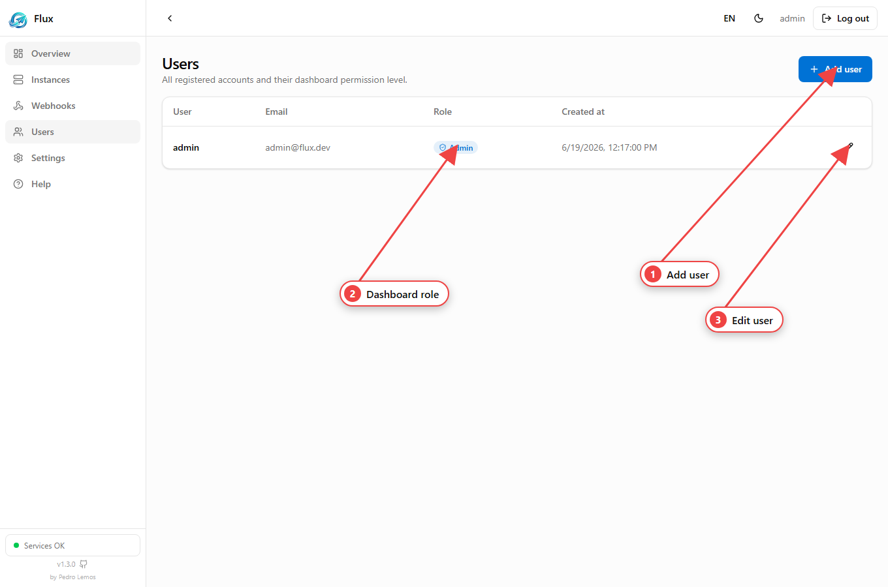
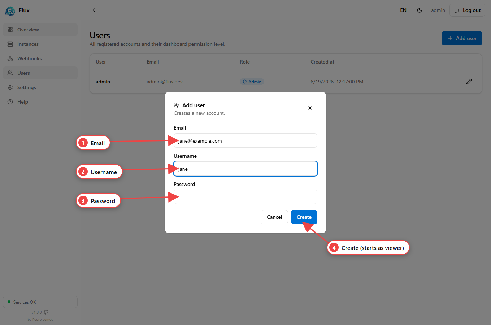
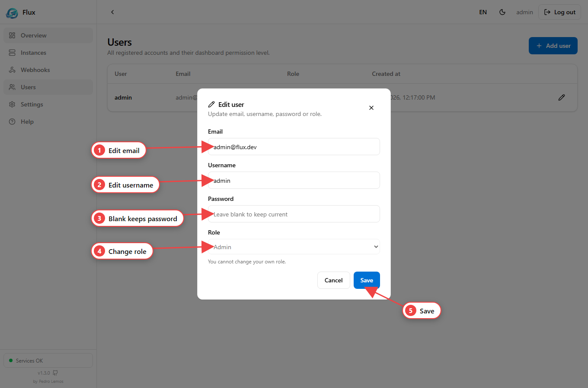

**Accounts** are the dashboard users who log in to Flux — distinct from the
Telegram [instances](/flux-docs/instances/) they operate. Each account has one
**role** that decides what it can do. Managing accounts requires the **admin**
role.



The **Users** page shows every account with its email, role and creation date;
admins add and edit users from here.

## Roles & permissions

| Capability | viewer | operator | admin |
| --- | :---: | :---: | :---: |
| Read instances, chats, messages, webhooks | ✅ | ✅ | ✅ |
| Manage/delete instances, send messages & media, manage webhooks | | ✅ | ✅ |
| Manage users (create, edit, delete, set roles) | | | ✅ |

The first user, seeded on first boot, is an **admin**.

## Create a user

Admins create accounts via `POST /auth/register`:

```bash
curl -X POST http://localhost:3000/auth/register \
  -H 'Authorization: Bearer <ADMIN_JWT>' -H 'x-api-key: <API_KEY>' \
  -H 'Content-Type: application/json' \
  -d '{"email":"jane@example.com","username":"jane","password":"S3cureP@ss"}'
```

New users start as `viewer`; promote them with a role change (below).

In the dashboard, **Add user** opens this modal:



## List, edit, delete

| Action | Route | Notes |
| --- | --- | --- |
| List users | `GET /users` | admin only |
| Change role | `PATCH /users/:id/role` `{ "role": "operator" }` | can't change your own |
| Edit user | `PATCH /users/:id` `{ email?, username?, password?, role? }` | only sent fields change |
| Delete user | `DELETE /users/:id` | cascades their instances & webhooks |

```bash
# Promote a user to operator
curl -X PATCH http://localhost:3000/users/<userId>/role \
  -H 'Authorization: Bearer <ADMIN_JWT>' -H 'x-api-key: <API_KEY>' \
  -H 'Content-Type: application/json' \
  -d '{"role":"operator"}'
```

The row pencil opens an **Edit user** modal covering email, username, password and
role in one place (you can't change your own role here):



:::caution[Self-protection]
You **cannot** change your own role or delete your own account through these
routes — this prevents an admin from accidentally locking everyone out. Ask
another admin, or edit a different field.
:::

User records never expose the password hash. See
[Authentication](/flux-docs/authentication/) for how these accounts log in.
