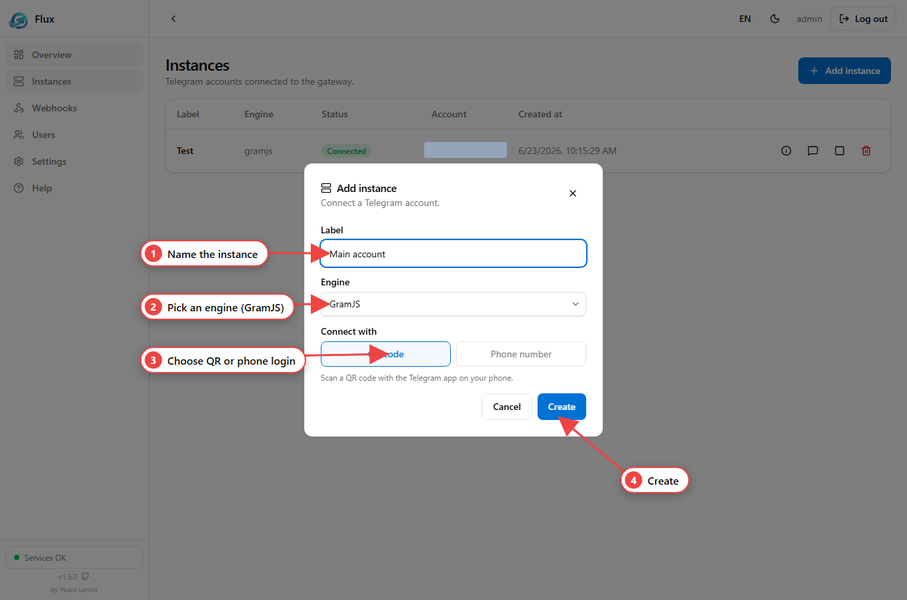

Flux ships a full **OpenAPI** spec rendered with **Scalar** at
[`/docs`](http://localhost:3000/docs) — an interactive reference where you can
read every schema and try requests in the browser. This page is the flat,
copy-friendly index of the same routes.

:::tip[Interactive docs]
Open `http://localhost:3000/docs` for the live Scalar UI: request/response
schemas, examples and a built-in client. It is public (no auth) so you can browse
it before logging in.
:::

## Auth model

Most routes require **both** a JWT (Bearer) and the **`x-api-key`** header. The
`auth` group and `/health` are the exceptions — see the **Auth** column.

| Layer | Header | From |
| --- | --- | --- |
| JWT | `Authorization: Bearer <token>` | `POST /auth/login` (also set as an `httpOnly` cookie) |
| API key | `x-api-key: <key>` | printed on first boot / `API_KEY` env |

For details see [Authentication](/flux-docs/authentication/). Browser SSE and
media tags that can't set headers may pass `?apiKey=<API_KEY>` instead.

## Auth

| Route | Method | Auth | Description |
| --- | --- | --- | --- |
| `/auth/register` | POST | Bearer + API key | Create a user (**admin only**) |
| `/auth/login` | POST | public | Log in; returns the JWT and sets the cookie |
| `/auth/logout` | POST | public | Clear the auth cookie |
| `/auth/me` | GET | Bearer (no API key) | Current user |
| `/auth/api-key-check` | GET | `x-api-key` | Validate the static API key |

## Telegram — settings & stats

| Route | Method | Description |
| --- | --- | --- |
| `/telegram/settings` | GET | Read `api_id` / `hasApiHash` (the hash never leaves) |
| `/telegram/settings` | PUT | Set the global `api_id` / `api_hash` |
| `/telegram/stats` | GET | Uptime + total / authorized / connected instances |

## Telegram — instances & login

| Route | Method | Description |
| --- | --- | --- |
| `/telegram/instances` | POST | Create an instance (`label`, `engine?`, `apiId?`, `apiHash?`) |
| `/telegram/instances` | GET | List instances |
| `/telegram/instances/:id` | GET | One instance |
| `/telegram/instances/:id` | DELETE | Remove the instance and its session |
| `/telegram/instances/:id/info` | GET | Details + live connection state + uptime |
| `/telegram/instances/:id/start` | POST | Connect from the saved session |
| `/telegram/instances/:id/stop` | POST | Disconnect (keeps the session) |
| `/telegram/instances/status/stream` | SSE | Status transitions for all instances |
| `/telegram/instances/:id/login/qr` | SSE | QR login stream: `qr` → `password_required` → `authorized` |
| `/telegram/instances/:id/login/phone` | POST | Start phone login `{ phone }` — Telegram sends a code |
| `/telegram/instances/:id/login/code` | POST | Submit the OTP `{ code }` → `password_required` or `authorized` |
| `/telegram/instances/:id/login/password` | POST | Submit the 2FA password `{ password }` |

See [Instances](/flux-docs/instances/) and [Sessions](/flux-docs/sessions/) for
the flows, and the **Add instance** modal:

## Telegram — chats, messages & media

| Route | Method | Description |
| --- | --- | --- |
| `/telegram/instances/:id/chats` | GET | List chats (most recent first) |
| `/telegram/instances/:id/chats/:chatId/messages` | GET | List messages (cursor-paginated: `?cursor=&limit=`) |
| `/telegram/instances/:id/chats/:chatId/messages` | POST | Send a text message `{ text }` (1–4096 chars) |
| `/telegram/instances/:id/chats/:chatId/media` | POST | Send photo/video/document (multipart `file` + `caption?`, ≤ 50 MB) |
| `/telegram/instances/:id/messages/stream` | SSE | Stream of new messages |
| `/telegram/instances/:id/chats/:chatId/photo` | GET | Chat/group avatar (bytes) |
| `/telegram/instances/:id/contacts/:contactId/photo` | GET | Contact avatar (bytes) |
| `/telegram/instances/:id/chats/:chatId/messages/:messageId/media` | GET | Message attachment (bytes, lazy download) |

Worked requests and response shapes for these are in
[Messaging](/flux-docs/messaging/); the raw types in
[Types & contracts](/flux-docs/types/).

## Webhooks

| Route | Method | Description |
| --- | --- | --- |
| `/webhooks/event-types` | GET | List the subscribable event types |
| `/webhooks` | POST | Create a webhook (`name`, `url`, `events`, `instanceIds?`, `allowInternal?`); returns the `secret` **once** |
| `/webhooks` | GET | List your webhooks |
| `/webhooks/:id` | GET | One webhook |
| `/webhooks/:id` | PATCH | Update (`name?`, `url?`, `active?`, `events?`, `allowInternal?`) |
| `/webhooks/:id` | DELETE | Remove the webhook and its deliveries |
| `/webhooks/:id/regenerate-secret` | POST | Rotate the signing secret (returned once) |
| `/webhooks/:id/instances/:instanceId` | POST | Link an instance (M2M) |
| `/webhooks/:id/instances/:instanceId` | DELETE | Unlink an instance |
| `/webhooks/:id/deliveries` | GET | Delivery log (`?limit=`, default 50) |
| `/webhooks/deliveries/:deliveryId/resend` | POST | Re-queue a delivery for immediate resend |

Full delivery semantics (signing, retry/backoff, headers) are in
[Webhooks](/flux-docs/webhooks/).

## Users & system

| Route | Method | Auth | Description |
| --- | --- | --- | --- |
| `/users` | GET | Bearer + API key | List users (**admin**) |
| `/users/:id/role` | PATCH | Bearer + API key | Change the global role (admin; not your own) |
| `/users/:id` | PATCH | Bearer + API key | Edit a user `{ email?, username?, password?, role? }` (admin) |
| `/users/:id` | DELETE | Bearer + API key | Delete a user, cascade instances/webhooks (admin; not yourself) |
| `/` | GET | public | Redirects to `/dashboard` |
| `/health` | GET | public | Postgres + Redis + Telegram + heap |
| `/docs` | GET | public | Scalar API Reference (OpenAPI) |
| `/dashboard` | GET | public | Vue SPA |
