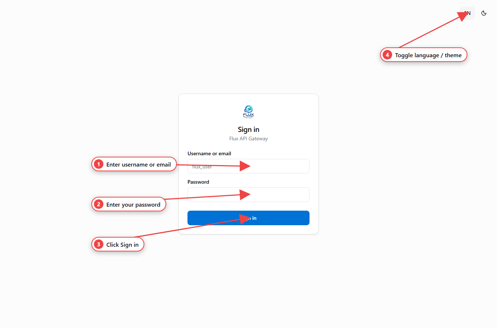

Two layers protect the API. Most routes require **both**:

1. **JWT** — identifies the dashboard user. You get it from `POST /auth/login`.
2. **API key** — the gateway's static key, sent as the `x-api-key` header.



The dashboard does both steps for you: enter the API key to unlock, then sign in
with your username/email and password.

## Log in

```bash
curl -X POST http://localhost:3000/auth/login \
  -H 'Content-Type: application/json' \
  -d '{"username":"admin","password":"secret"}'
```

```json
{ "accessToken": "eyJhbGciOi..." }
```

`username` accepts a **username or email**. The token is returned in the body
**and** set as an `httpOnly` cookie, so browser clients are authenticated
automatically; API clients send it as a bearer token.

## Authenticated requests

```bash
curl http://localhost:3000/telegram/instances \
  -H 'Authorization: Bearer <JWT>' \
  -H 'x-api-key: <API_KEY>'
```

| Where to get it | Value |
| --- | --- |
| `Authorization: Bearer …` | the `accessToken` from `/auth/login` |
| `x-api-key: …` | the API key printed on first boot (or set via `API_KEY`) |

:::note[Streams & media in the browser]
`EventSource` and `` tags can't send headers. For SSE streams and media
URLs you may pass the key as a query parameter instead: `?apiKey=<API_KEY>`.
:::

## Helper endpoints

| Route | Method | Auth | Purpose |
| --- | --- | --- | --- |
| `/auth/login` | POST | public | Log in; returns the JWT and sets the cookie |
| `/auth/logout` | POST | public | Clears the auth cookie |
| `/auth/me` | GET | JWT only (no API key) | The current user |
| `/auth/api-key-check` | GET | `x-api-key` | Returns `200` if the key is valid |

```bash
# Check the current user
curl http://localhost:3000/auth/me -H 'Authorization: Bearer <JWT>'

# Validate just the API key
curl http://localhost:3000/auth/api-key-check -H 'x-api-key: <API_KEY>'
# → { "ok": true, "via": "api-key" }
```

## What's exempt

`auth` routes and `/health` don't require the API key. `/auth/me` needs the JWT
but not the key. Everything else needs both.

Under the hood: passwords are hashed with Argon2id, the API key is compared in
constant time, and requests are rate-limited per IP. To manage **who** can log
in and what they can do, see [Accounts](/flux-docs/accounts/).
