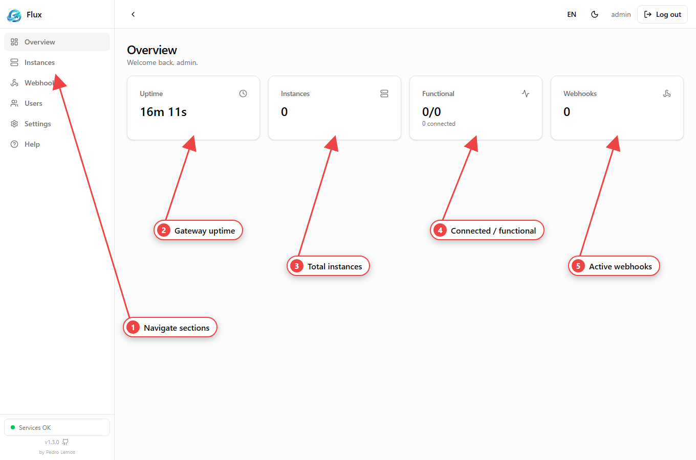
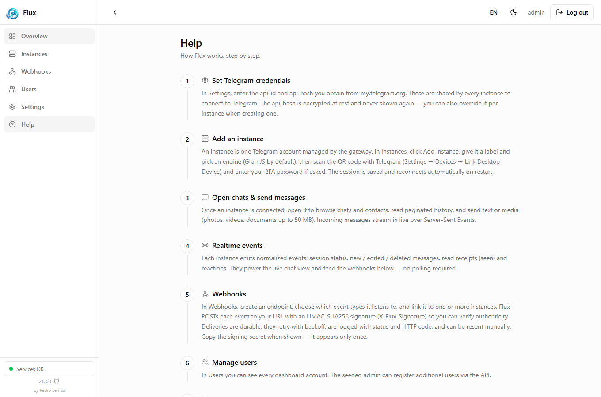

import { Tabs, TabItem } from '@astrojs/starlight/components';

This page takes you from nothing to a connected account sending a message. Each step links to its full guide.

## 1. Run the gateway

Flux ships as a **single image** that bundles the API, PostgreSQL and Redis in
one container. Launch it either way — both run the same image:

<Tabs>
  <TabItem label="docker run">

Pull and run the published image — nothing to clone:

```bash
# Docker Hub
docker run -d -p 3000:3000 -v flux_data:/data pedrooaj/flux-api

# or GitHub Container Registry
docker run -d -p 3000:3000 -v flux_data:/data ghcr.io/pedrol3m0z/flux-api
```

  </TabItem>
  <TabItem label="docker-compose.yml">

Write your own `docker-compose.yml` pointing at the published image, with a named
volume for `/data`. Set credentials inline (or leave them out to auto-generate):

```yaml
# docker-compose.yml
services:
  flux:
    image: pedrooaj/flux-api
    ports:
      - "3000:3000"
    volumes:
      - flux_data:/data
    environment:
      SEED_USERNAME: admin
      SEED_PASSWORD: ch4nge-me
      API_KEY: my-api-key
    restart: unless-stopped

volumes:
  flux_data:
```

Then bring it up:

```bash
docker compose up -d
```

  </TabItem>
</Tabs>

The image is built for `linux/amd64` and tagged per release (`X.Y.Z`, `X.Y`,
`latest`). The `/data` volume persists the database, Redis data and the
auto-generated secrets — **keep it** across container recreations. One container,
no service isolation: a restart cycles every process — ideal for single-host /
self-hosting.

| Surface | URL |
| --- | --- |
| API | `http://localhost:3000` |
| Dashboard | `http://localhost:3000/dashboard` |
| Interactive API docs (Scalar) | `http://localhost:3000/docs` |

:::tip[Zero configuration]
No environment variables are required. On first boot Flux generates strong
secrets and an initial **admin** user, printing the **API key** and the admin
**password** to the log **once** (`docker logs <container>`) — copy them now.
They are also persisted under the `/data` volume (`secrets.json`).
:::

### Set your own credentials (optional)

Rather than copy auto-generated values from the log, you can choose the admin
**username**, **password** and **API key** up front with environment variables.
Anything left empty is still auto-generated.

| Variable | Sets | Default if empty |
| --- | --- | --- |
| `SEED_USERNAME` | admin login username | `admin` |
| `SEED_PASSWORD` | admin login password | generated, printed to log once |
| `SEED_EMAIL` | admin email | generated |
| `API_KEY` | the `x-api-key` value | generated, printed to log once |

<Tabs>
  <TabItem label="docker run">

Pass them with `-e`:

```bash
docker run -d -p 3000:3000 -v flux_data:/data \
  -e SEED_USERNAME=admin \
  -e SEED_PASSWORD='ch4nge-me' \
  -e API_KEY='my-api-key' \
  pedrooaj/flux-api
```

  </TabItem>
  <TabItem label="Docker Compose">

Put them in a `.env` next to `docker-compose.yml` (it reads the file
automatically):

```bash
# .env
SEED_USERNAME=admin
SEED_PASSWORD=ch4nge-me
API_KEY=my-api-key
```

  </TabItem>
</Tabs>

These seed the **first** boot only — they create the admin user and secrets and
are then persisted under `/data` (`secrets.json`). Changing them later does
**not** rewrite an existing account; reset by clearing the volume or changing the
password in the dashboard. Treat `SEED_PASSWORD` / `API_KEY` as secrets — don't
commit them.

## 2. Log in

Every protected request needs two things: a **JWT** (who you are) and the
**API key** (`x-api-key`). Get the JWT by logging in:

```bash
curl -X POST http://localhost:3000/auth/login \
  -H 'Content-Type: application/json' \
  -d '{"username":"admin","password":"<from the boot log>"}'
# → { "accessToken": "<JWT>" }
```

See [Authentication](/flux-docs/authentication/) for the full picture.

## 3. Set your Telegram credentials

Flux talks to Telegram with an `api_id` / `api_hash` from
[my.telegram.org](https://my.telegram.org):

```bash
curl -X PUT http://localhost:3000/telegram/settings \
  -H 'Authorization: Bearer <JWT>' \
  -H 'x-api-key: <API_KEY>' \
  -H 'Content-Type: application/json' \
  -d '{"apiId":"123456","apiHash":"abcdef..."}'
```

More in [Telegram credentials](/flux-docs/telegram-credentials/).

## 4. Create an instance

```bash
curl -X POST http://localhost:3000/telegram/instances \
  -H 'Authorization: Bearer <JWT>' -H 'x-api-key: <API_KEY>' \
  -H 'Content-Type: application/json' \
  -d '{"label":"Main account"}'
# → { "id": "<instanceId>", "status": "new", ... }
```

See [Instances](/flux-docs/instances/).

## 5. Authorize it (log in to Telegram)

Open a QR login stream and scan the code with your phone, or log in by phone
number + code. Full flows in [Sessions](/flux-docs/sessions/).

## 6. Send a message

```bash
curl -X POST \
  http://localhost:3000/telegram/instances/<instanceId>/chats/<chatId>/messages \
  -H 'Authorization: Bearer <JWT>' -H 'x-api-key: <API_KEY>' \
  -H 'Content-Type: application/json' \
  -d '{"text":"Hello from Flux"}'
```

From here, subscribe to [Webhooks](/flux-docs/webhooks/) or stream
[Events](/flux-docs/events/) to react to incoming messages.

## Prefer the dashboard?

Everything above is also point-and-click at `http://localhost:3000/dashboard`:
log in, set credentials in **Settings**, create an instance, connect it via QR
or phone, and open its chats.



The **Overview** shows uptime, instance and webhook counts, and service health at
a glance. The in-app **Help** page walks through the same flow step by step.


