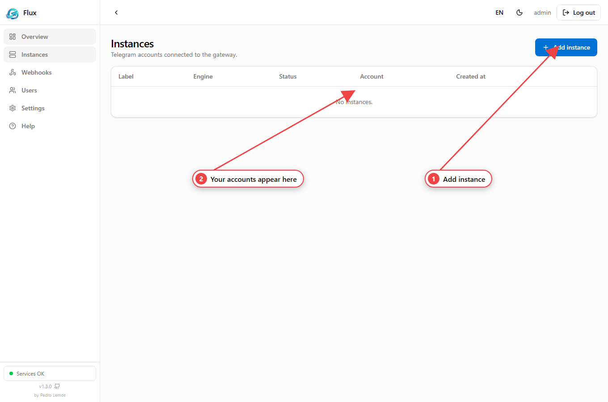
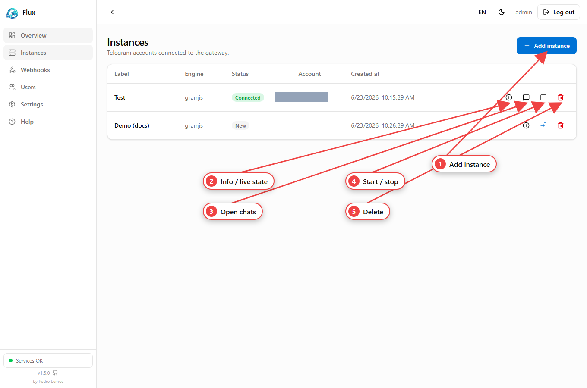

An **instance** is one Telegram account managed by Flux. You create it, authorize
it once (see [Sessions](/flux-docs/sessions/)), then use it to read and send
messages.



## Create an instance

### In the dashboard


1. **Instances → Add instance**.
2. Give it a **label**, pick an **engine** (GramJS by default).
3. Choose a login method (QR or phone) and **Create**.

### Via the API

`POST /telegram/instances` — JWT + API key.

| Field | Type | Required | Rules | Description |
| --- | --- | :---: | --- | --- |
| `label` | string | yes | 1–64 chars | Human-readable name |
| `engine` | string | no | `gramjs` \| `telegraf` (default `gramjs`) | Telegram backend — see [Engines](/flux-docs/engines/) |
| `apiId` | string | no | digits only | Override the global [api_id](/flux-docs/telegram-credentials/) |
| `apiHash` | string | no | — | Override the global api_hash |

```json
// POST /telegram/instances
{ "label": "Main account", "engine": "gramjs" }
```

The new instance starts in status `new` — it has no Telegram session yet. The
response is an `InstanceView` (see [Types](/flux-docs/types/)).

## Status values

| Status | Meaning |
| --- | --- |
| `new` | Created, never logged in |
| `connecting` | Establishing the connection |
| `awaiting_qr` / `awaiting_code` | Waiting for a QR scan / phone code |
| `password_required` | Waiting for the 2FA password |
| `authorized` | Connected and usable |
| `disconnected` | Stopped, session kept |
| `error` | Session revoked/expired — log in again |

## Operate an instance

### In the dashboard



Each row exposes, as icon buttons: **info** (live state), **open chats**,
**start/stop**, and **delete**.

### Via the API

| Route | Method | Description |
| --- | --- | --- |
| `/telegram/instances` | GET | List instances |
| `/telegram/instances/:id` | GET | One instance |
| `/telegram/instances/:id/info` | GET | Details + live connection state + uptime |
| `/telegram/instances/:id/start` | POST | Connect from the saved session |
| `/telegram/instances/:id/stop` | POST | Disconnect (keeps the session) |
| `/telegram/instances/:id` | DELETE | Remove the instance **and its session** (cascades chats/messages) |

`start`/`stop`/`delete` take no body. To authorize a `new` instance, see
[Sessions](/flux-docs/sessions/).

## Chats, messages & media

Once an instance is `authorized` you can browse chats and contacts, read
paginated history, and send text or media (photos, videos, documents up to
50 MB) — in the dashboard, or over the API. The full walkthrough with worked
requests and response shapes is in **[Messaging](/flux-docs/messaging/)**:

| Action | Route | Method |
| --- | --- | --- |
| List chats | `/telegram/instances/:id/chats` | GET |
| Read history | `/telegram/instances/:id/chats/:chatId/messages` | GET |
| Send text | `/telegram/instances/:id/chats/:chatId/messages` | POST |
| Send media | `/telegram/instances/:id/chats/:chatId/media` | POST |
| Download attachment | `…/chats/:chatId/messages/:messageId/media` | GET |
| Chat / contact avatar | `…/chats/:chatId/photo`, `…/contacts/:contactId/photo` | GET |

To react to incoming messages, stream [Events](/flux-docs/events/) or subscribe a
[Webhook](/flux-docs/webhooks/). For an account-wide view, `GET /telegram/stats`
returns uptime and total/authorized/connected counts.
