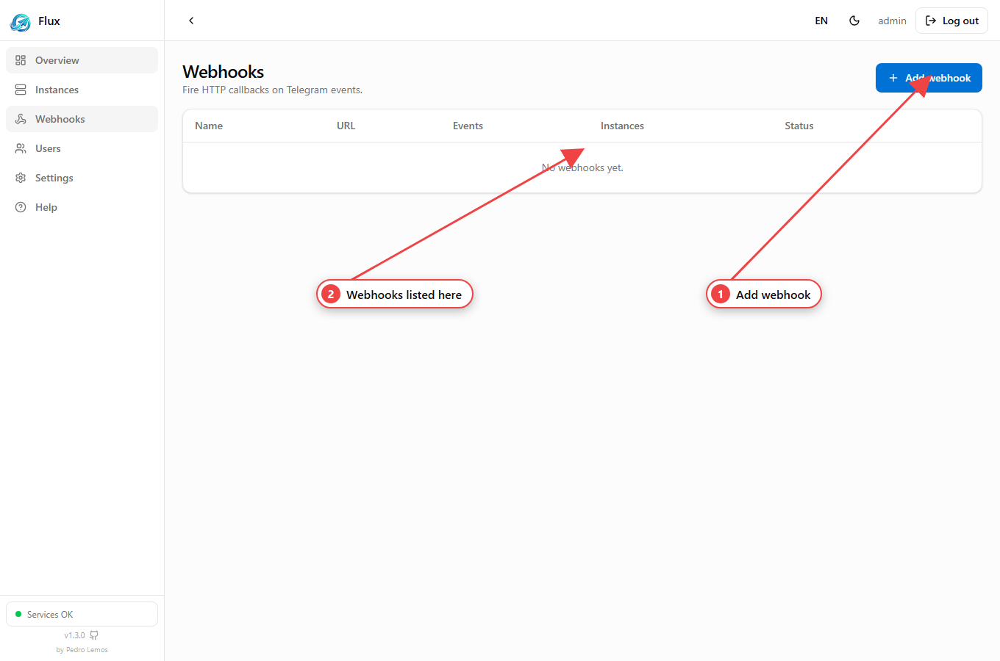
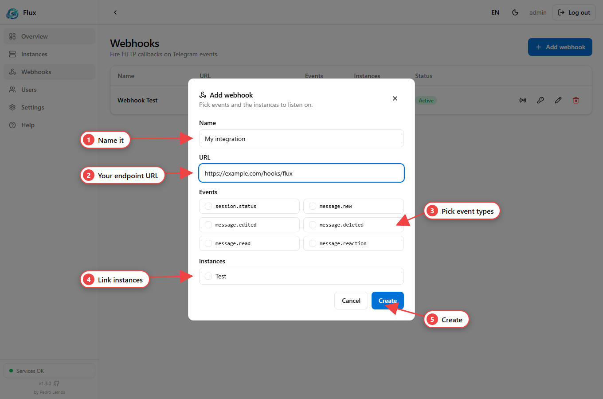
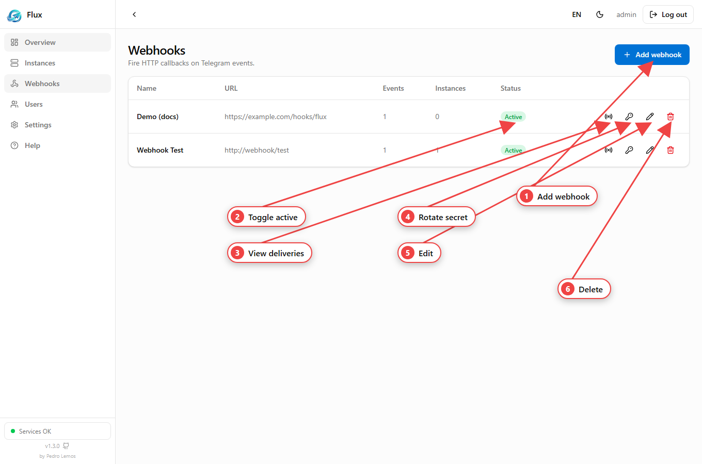
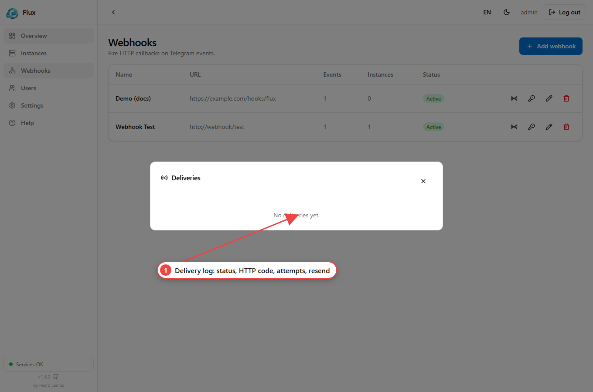

A **webhook** delivers events to a URL you own. You subscribe it to a subset of
[event types](/flux-docs/events/) and link it to one or more
[instances](/flux-docs/instances/); whenever a matching event happens, Flux POSTs
it to your endpoint with retries and an HMAC signature.



## Create a webhook

### In the dashboard



1. **Webhooks → Add webhook**.
2. Set a **name** and your **URL**, tick the **event types**, link the
   **instances** to listen on.
3. Pick the **target scope** — **External** (public internet, default) or
   **Internal** (a private/loopback address on the same network).
4. **Create** — the signing **secret** is shown **once**; copy it now.

### Via the API

`POST /webhooks` — JWT + API key.

| Field | Type | Required | Rules | Description |
| --- | --- | :---: | --- | --- |
| `name` | string | yes | 1–80 chars | Label for the webhook |
| `url` | string | yes | valid URL | Where deliveries are POSTed |
| `events` | string[] | yes | non-empty; each a valid [event type](/flux-docs/events/) | Which events to send |
| `instanceIds` | string[] | no | instance ids | Instances to listen on (link later if omitted) |
| `allowInternal` | boolean | no | default `false` | Allow a **private/loopback** target (same Docker network / LAN) — see [Target scope](#target-scope-external-vs-internal) |

```json
// POST /webhooks
{
  "name": "My integration",
  "url": "https://example.com/hooks/flux",
  "events": ["message.new", "message.read"],
  "instanceIds": ["<instanceId>"],
  "allowInternal": false
}
```

The response is a `WebhookWithSecret` — the `secret` (prefix `whsec_`) appears
**only here**. List the subscribable types with `GET /webhooks/event-types`.

## Receiving a delivery

Flux sends a `POST` with this body:

```json
{
  "event": "message.new",
  "instanceId": "<instanceId>",
  "at": "2026-06-19T12:00:00.000Z",
  "data": { "...": "the event payload, e.g. a MessageView" }
}
```

And these headers:

| Header | Content |
| --- | --- |
| `Content-Type` | `application/json` |
| `User-Agent` | `Flux-Webhooks/1.0` |
| `X-Flux-Event` | event type (e.g. `message.new`) |
| `X-Flux-Delivery` | delivery id — use it for idempotency |
| `X-Flux-Instance` | source instance id (when applicable) |
| `X-Flux-Signature` | `sha256=<hmac-hex>` of the raw body, using the webhook `secret` |

## Verify the signature

Always verify before trusting a delivery. Sign the **raw** body with your secret
and compare in constant time:

```ts
import { createHmac, timingSafeEqual } from 'node:crypto';

function verify(rawBody: string, header: string, secret: string): boolean {
  const expected = `sha256=${createHmac('sha256', secret).update(rawBody).digest('hex')}`;
  const a = Buffer.from(expected);
  const b = Buffer.from(header);
  return a.length === b.length && timingSafeEqual(a, b);
}
```

## Delivery guarantees

- **Durable** — every attempt is stored, surviving restarts.
- **Retried with backoff** — `10s → 1m → 5m → 30m → 2h`; after **6 attempts** a
  delivery is marked `dead`. Each record exposes `nextAttemptAt`.
- **Auditable** — every delivery captures the target's **response body** (a
  truncated snippet, up to 2000 chars) and the last error; inspect the log and
  re-send manually.

## Manage

### In the dashboard



Each row: toggle **active**, view **deliveries**, **rotate secret**, **edit**,
**delete**. The deliveries log shows status, HTTP code and attempts, with a manual
resend; a failed delivery auto-expands a detail panel with the **error**, the
target's **response body** and the **next-attempt time**:



### Via the API

| Action | Route | Method |
| --- | --- | --- |
| List your webhooks | `/webhooks` | GET |
| Get one | `/webhooks/:id` | GET |
| Update | `/webhooks/:id` | PATCH |
| Delete (and its deliveries) | `/webhooks/:id` | DELETE |
| Rotate the secret (returned once) | `/webhooks/:id/regenerate-secret` | POST |
| Link an instance | `/webhooks/:id/instances/:instanceId` | POST |
| Unlink an instance | `/webhooks/:id/instances/:instanceId` | DELETE |
| Delivery log (`?limit=`, default 50) | `/webhooks/:id/deliveries` | GET |
| Re-queue a delivery now | `/webhooks/deliveries/:deliveryId/resend` | POST |

**Update** (`PATCH /webhooks/:id`) — all fields optional:

| Field | Type | Rules | Description |
| --- | --- | --- | --- |
| `name` | string | 1–80 chars | Rename |
| `url` | string | valid URL | Change the endpoint |
| `active` | boolean | — | Enable/disable delivery |
| `events` | string[] | valid event types | Replace the subscription |
| `allowInternal` | boolean | — | Toggle private/loopback targets (see below) |

## Target scope (External vs Internal)

By default a webhook is **External**: URLs pointing at localhost, private or
reserved IP ranges are **rejected** on create/update and re-checked (with DNS
resolution) **before every delivery**, so a webhook can't be used to reach
internal addresses (SSRF guard).

Set **`allowInternal: true`** (the **Internal** choice in the form) to deliver to
a private/loopback address — e.g. another service on the **same Docker network or
LAN**, like a local n8n. This relaxes the guard for private/loopback ranges only.

:::caution[Always blocked]
**Cloud-metadata and link-local addresses stay blocked unconditionally**, even
with `allowInternal: true`. For public targets, keep it `false` and use a
reachable HTTPS URL.
:::
